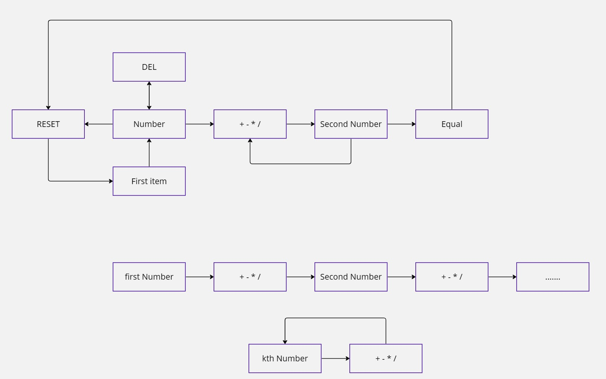
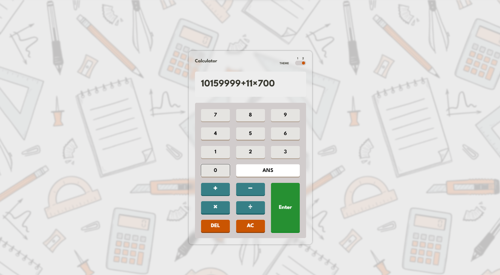

# Calculator

Welcome to my Calculator-Website project! This interactive web calculator not only provides a sleek and user-friendly interface for performing basic arithmetic operations but also supports keyboard navigation for an enhanced user experience.

## [Live Demo](https://main--mansy-calculator.netlify.app/)

## Planning


## light Mode 


## Dark Mode 


## Features

- Toggle between light and dark themes.
- Basic arithmetic operations: addition (+), subtraction (-), multiplication (×), division (÷).
- ANS button to recall the last calculated result.
- Clear (AC) and delete (DEL) functionalities.

## Technologies Used

- HTML
- CSS
- SASS
- JavaScript
- ESLint

## Getting Started

1. Clone the repository:

```bash
git clone https://github.com/MMansy19/Calculator-Website.git
```

2. Open the project in your preferred code editor.

3. Open the `index.html` file in a web browser.

4. Start using the calculator!

## Usage

- Click on the number buttons to input numbers.
- Click on the operation buttons to perform calculations.
- Use DEL to delete the last digit.
- Use AC to clear the calculator.


## Technologies Used

- HTML
- CSS
- SASS
- JavaScript
